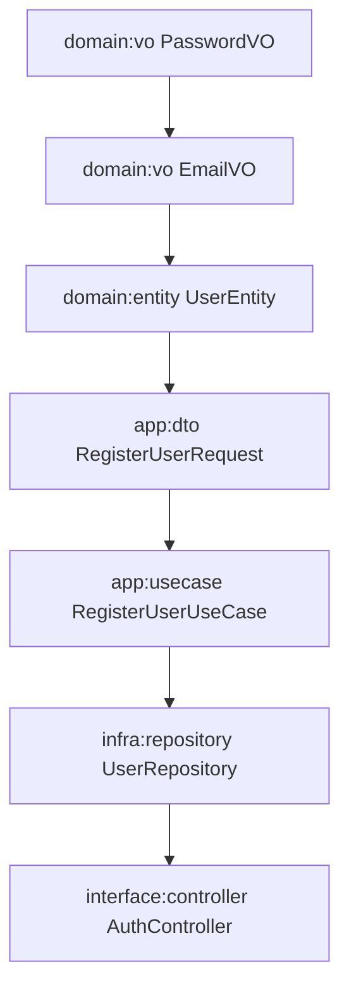

# Template de Tasks OpenSpec para Stack C#

**Propósito**: Fornecer exemplos práticos e reutilizáveis de tasks OpenSpec específicas para a stack C# + Vue + Android do projeto RetailOps.

---

## 🏗️ **Estrutura Padrão de Tasks por Bounded Context**

### **BC-001: Auth e Usuários (C#)**
```markdown
## EP-001: Auth e Usuários (C# + Vue + Android)

### 1. Domínio C# — Auth
- [ ] `domain:vo` PasswordVO com hash bcrypt (~1h)
  - **Agent:** `Core Value Object (C#)`
  - **Prompt:** "Crie PasswordVO com Create() retornando Result<T> e hash bcrypt."
  - **Specs:** ["password-policy"]
  
- [ ] `domain:vo` EmailVO com validação RFC 5322 (~45min)
  - **Agent:** `Core Value Object (C#)`
  - **Prompt:** "Crie EmailVO com validação de formato e domínio."
  - **Specs:** ["email-validation"]
  
- [ ] `domain:entity` UserEntity com regras de negócio (~2h)
  - **Agent:** `Core Entity (C#)`
  - **Prompt:** "Crie UserEntity com EmailVO, PasswordVO, roles e métodos ChangePassword/UpdateProfile."
  - **Dependencies:** `domain:vo:password`, `domain:vo:email`
  - **Specs:** ["user-business-rules"]

### 2. Aplicação C# — Auth
- [ ] `app:dto` RegisterUserRequest com validação (~1h)
  - **Agent:** `Core DTO (C#)`
  - **Prompt:** "Crie RegisterUserRequest com email, password, confirmPassword e validações."
  - **Dependencies:** `domain:vo:email`, `domain:vo:password`
  
- [ ] `app:dto` LoginRequest e AuthResponse (~45min)
  - **Agent:** `Core DTO (C#)`
  - **Prompt:** "Crie LoginRequest (email, password) e AuthResponse (token, user)."
  
- [ ] `app:usecase` RegisterUserUseCase com transação (~2h)
  - **Agent:** `Core Use Case (C#)`
  - **Prompt:** "Crie RegisterUserUseCase que valida email único, hash password e cria usuário."
  - **Dependencies:** `app:dto:register`, `domain:entity:user`
  
- [ ] `app:usecase` LoginUseCase com JWT (~2h)
  - **Agent:** `Core Use Case (C#)`
  - **Prompt:** "Crie LoginUseCase que valida credenciais e gera JWT token."
  - **Dependencies:** `app:dto:login`, `domain:entity:user`

### 3. Infraestrutura C# — Auth
- [ ] `infra:repository` UserRepository com EF Core (~2h)
  - **Agent:** `Backend Data (C#)`
  - **Prompt:** "Crie UserRepository com métodos FindByEmail, Save, Update usando EF Core."
  - **Dependencies:** `domain:entity:user`
  
- [ ] `infra:persistence` UserEntityConfiguration (~1h)
  - **Agent:** `Backend Data (C#)`
  - **Prompt:** "Crie configuração Fluent API para UserEntity com índices e constraints."
  - **Dependencies:** `domain:entity:user`

### 4. Interface C# — Auth
- [ ] `interface:controller` AuthController com endpoints (~3h)
  - **Agent:** `Backend Controller (C#)`
  - **Prompt:** "Crie AuthController com POST /register, POST /login, GET /me usando JWT."
  - **Dependencies:** `app:usecase:register`, `app:usecase:login`
  - **Specs:** ["auth-endpoints"]

### 5. Domínio Vue — Auth
- [ ] `interface:entity` UserEntity Vue com TypeScript (~1h)
  - **Agent:** `Frontend Entity Vue`
  - **Prompt:** "Crie UserEntity Vue com email, token e métodos de validação."
  
- [ ] `interface:usecase` AuthUseCase Vue com axios (~2h)
  - **Agent:** `Frontend Usecase Vue`
  - **Prompt:** "Crie AuthUseCase Vue com login, register, logout usando axios."
  - **Dependencies:** `interface:entity:user-vue`

### 6. Interface Vue — Auth
- [ ] `interface:page` LoginPage Vue com vee-validate (~3h)
  - **Agent:** `Frontend Page Vue`
  - **Prompt:** "Crie LoginPage Vue com formulário, validação e integração com AuthUseCase."
  - **Dependencies:** `interface:usecase:auth-vue`
  
- [ ] `interface:page` RegisterPage Vue (~2h)
  - **Agent:** `Frontend Page Vue`
  - **Prompt:** "Crie RegisterPage Vue com formulário de cadastro completo."
  - **Dependencies:** `interface:usecase:auth-vue`

### 7. Domínio Android — Auth
- [ ] `interface:mobile-entity` UserEntity Android Kotlin (~1h)
  - **Agent:** `Mobile Entity Android`
  - **Prompt:** "Crie UserEntity Android com data class e validações."
  
- [ ] `interface:mobile-usecase` AuthUseCase Android com Retrofit (~2h)
  - **Agent:** `Mobile Usecase Android`
  - **Prompt:** "Crie AuthUseCase Android com login, register usando Retrofit."
  - **Dependencies:** `interface:mobile-entity:user-android`

### 8. Interface Android — Auth
- [ ] `interface:mobile` LoginScreen Android Compose (~3h)
  - **Agent:** `Mobile Screen Android`
  - **Prompt:** "Crie LoginScreen Android com Jetpack Compose e ViewModel."
  - **Dependencies:** `interface:mobile-usecase:auth-android`
```

---

### **BC-002: Produtos e Catálogo (C#)**
```markdown
## EP-002: Produtos e Catálogo (C# + Vue)

### 1. Domínio C# — Produtos
- [ ] `domain:vo` MoneyVO com validação monetária (~1h)
  - **Agent:** `Core Value Object (C#)`
  - **Prompt:** "Crie MoneyVO com valor decimal, moeda BRL e operações aritméticas."
  - **Specs:** ["money-operations"]
  
- [ ] `domain:vo` SkuVO com geração automática (~45min)
  - **Agent:** `Core Value Object (C#)`
  - **Prompt:** "Crie SkuVO com padrão PROD-XXXXX e validação."
  - **Specs:** ["sku-format"]
  
- [ ] `domain:entity` ProductEntity com estoque (~3h)
  - **Agent:** `Core Entity (C#)`
  - **Prompt:** "Crie ProductEntity com SkuVO, Name, Description, MoneyVO Price, StockQuantity e métodos UpdateStock/ChangePrice."
  - **Dependencies:** `domain:vo:money`, `domain:vo:sku`
  - **Specs:** ["product-business-rules"]

### 2. Aplicação C# — Produtos
- [ ] `app:dto` CreateProductRequest com validação (~1h)
  - **Agent:** `Core DTO (C#)`
  - **Prompt:** "Crie CreateProductRequest com name, description, price, sku (opcional)."
  - **Dependencies:** `domain:vo:money`, `domain:vo:sku`
  
- [ ] `app:dto` ProductResponse com projeção (~1h)
  - **Agent:** `Core DTO (C#)`
  - **Prompt:** "Crie ProductResponse com id, sku, name, description, price, stock."
  
- [ ] `app:usecase` CreateProductUseCase com validação (~2h)
  - **Agent:** `Core Use Case (C#)`
  - **Prompt:** "Crie CreateProductUseCase que valida sku único e cria produto."
  - **Dependencies:** `app:dto:create-product`, `domain:entity:product`
  
- [ ] `app:query` GetProductsQuery com paginação (~2h)
  - **Agent:** `Core Query CQRS (C#)`
  - **Prompt:** "Crie GetProductsQuery com filtros por nome, categoria e ordenação."
  - **Dependencies:** `app:dto:product-response`

### 3. Infraestrutura C# — Produtos
- [ ] `infra:repository` ProductRepository com queries otimizadas (~3h)
  - **Agent:** `Backend Data (C#)`
  - **Prompt:** "Crie ProductRepository com métodos FindBySku, Search, GetPaginated."
  - **Dependencies:** `domain:entity:product`
  
- [ ] `infra:persistence` ProductEntityConfiguration com índices (~1h)
  - **Agent:** `Backend Data (C#)`
  - **Prompt:** "Crie configuração para ProductEntity com índices em Sku e Name."
  - **Dependencies:** `domain:entity:product`

### 4. Interface C# — Produtos
- [ ] `interface:controller` ProductsController CRUD (~4h)
  - **Agent:** `Backend Controller (C#)`
  - **Prompt:** "Crie ProductsController com GET /products, POST /products, PUT /products/{id}."
  - **Dependencies:** `app:usecase:create-product`, `app:query:get-products`
  - **Specs:** ["products-crud"]

### 5. Interface Vue — Produtos
- [ ] `interface:page` ProductsListPage Vue com DataTable (~4h)
  - **Agent:** `Frontend Page Vue`
  - **Prompt:** "Crie ProductsListPage Vue com tabela paginada, filtros e ações."
  - **Dependencies:** `interface:repository:products-vue`
  
- [ ] `interface:page` CreateProductPage Vue com formulário (~3h)
  - **Agent:** `Frontend Page Vue`
  - **Prompt:** "Crie CreateProductPage Vue com formulário completo e validação."
  - **Dependencies:** `interface:usecase:products-vue`
```

---

### **BC-003: Pedidos e Checkout (C#)**
```markdown
## EP-003: Pedidos e Checkout (C# + Vue + Android)

### 1. Domínio C# — Pedidos
- [ ] `domain:vo` OrderNumberVO com sequência (~1h)
  - **Agent:** `Core Value Object (C#)`
  - **Prompt:** "Crie OrderNumberVO com padrão ORD-YYYYMMDD-XXXXX."
  - **Specs:** ["order-number-format"]
  
- [ ] `domain:entity` OrderItemEntity com cálculo (~2h)
  - **Agent:** `Core Entity (C#)`
  - **Prompt:** "Crie OrderItemEntity com ProductId, Quantity, UnitPrice e método CalculateTotal."
  - **Dependencies:** `domain:vo:money`
  
- [ ] `domain:entity` OrderEntity com status (~4h)
  - **Agent:** `Core Entity (C#)`
  - **Prompt:** "Crie OrderEntity com OrderNumberVO, CustomerId, List<OrderItem>, Status e métodos AddItem/RemoveItem/CalculateTotal/ChangeStatus."
  - **Dependencies:** `domain:vo:order-number`, `domain:entity:order-item`
  - **Specs:** ["order-state-machine"]

### 2. Aplicação C# — Pedidos
- [ ] `app:dto` CreateOrderRequest com itens (~2h)
  - **Agent:** `Core DTO (C#)`
  - **Prompt:** "Crie CreateOrderRequest com customerId e lista de OrderItemRequest."
  - **Dependencies:** `domain:entity:order-item`
  
- [ ] `app:usecase` CreateOrderUseCase com transação distribuída (~4h)
  - **Agent:** `Core Use Case (C#)`
  - **Prompt:** "Crie CreateOrderUseCase que valida estoque, calcula total e cria pedido."
  - **Dependencies:** `app:dto:create-order`, `domain:entity:order`
  
- [ ] `app:usecase` ProcessPaymentUseCase com gateway (~3h)
  - **Agent:** `Core Use Case (C#)`
  - **Prompt:** "Crie ProcessPaymentUseCase que integra com gateway de pagamento."
  - **Dependencies:** `domain:entity:order`

### 3. Infraestrutura C# — Pedidos
- [ ] `infra:repository` OrderRepository com includes (~3h)
  - **Agent:** `Backend Data (C#)`
  - **Prompt:** "Crie OrderRepository com métodos GetWithItems, FindByCustomer."
  - **Dependencies:** `domain:entity:order`
  
- [ ] `infra:persistence` OrderConfiguration com relacionamentos (~2h)
  - **Agent:** `Backend Data (C#)`
  - **Prompt:** "Crie configuração para OrderEntity com relacionamento 1:N com OrderItem."
  - **Dependencies:** `domain:entity:order`, `domain:entity:order-item`
```

---

## 🎯 **Padrões de Nomenclatura para Tasks C#**

### **Prefixos por Camada**
```markdown
# Domínio C#
- `domain:vo`        # Value Objects
- `domain:entity`    # Entidades
- `domain:service`   # Serviços de Domínio
- `domain:event`     # Eventos de Domínio

# Aplicação C#
- `app:dto`          # Data Transfer Objects
- `app:usecase`      # Casos de Uso
- `app:query`        # Queries CQRS
- `app:command`      # Commands CQRS

# Infraestrutura C#
- `infra:repository` # Repositórios
- `infra:persistence` # Configurações EF Core
- `infra:service`    # Serviços de Infraestrutura

# Interface C#
- `interface:controller` # Controllers ASP.NET Core
- `interface:middleware` # Middleware
- `interface:filter`     # Filters
```

### **Exemplos de Prompts Específicos**

#### **Value Objects C#**
```markdown
- [ ] `domain:vo` EmailVO com validação RFC 5322 (~45min)
  - **Agent:** `Core Value Object (C#)`
  - **Prompt:** "Crie EmailVO como record struct com validação de formato usando Regex.IsMatch para RFC 5322. Inclua método estático Create que retorna Result<EmailVO>. Adicione propriedades Value e Domain."
  - **Specs:** ["email-validation-rfc5322"]
```

#### **Entidades C# com EF Core**
```markdown
- [ ] `domain:entity` ProductEntity com estoque e preço (~3h)
  - **Agent:** `Core Entity (C#)`
  - **Prompt:** "Crie ProductEntity como classe com Id (Guid), Name (string), Description (string?), Price (MoneyVO), StockQuantity (int). Adicione métodos UpdateStock(int quantity) que valida quantidade não negativa e ChangePrice(MoneyVO newPrice). Use private setters e construtor privado com método estático Create."
  - **Dependencies:** `domain:vo:money`
  - **Specs:** ["product-invariants"]
```

#### **Controllers C# com ASP.NET Core**
```markdown
- [ ] `interface:controller` ProductsController com autorização (~4h)
  - **Agent:** `Backend Controller (C#)`
  - **Prompt:** "Crie ProductsController com [Authorize] e endpoints: GET /api/products (paginação), GET /api/products/{id}, POST /api/products (apenas Admin), PUT /api/products/{id} (apenas Admin). Use MediatR para commands/queries. Retorne ActionResult com códigos HTTP apropriados."
  - **Dependencies:** `app:usecase:create-product`, `app:query:get-products`
  - **Specs:** ["products-api-rest"]
```

---

## 🔄 **Workflow Completo para Stack C#**

### **Sequência Inside-Out para C#**
```
1. Value Objects (domain:vo)
   ↓
2. Entidades (domain:entity) 
   ↓
3. Serviços de Domínio (domain:service)
   ↓
4. DTOs (app:dto)
   ↓
5. Casos de Uso (app:usecase)
   ↓
6. Queries (app:query)
   ↓
7. Repositórios (infra:repository)
   ↓
8. Configurações EF Core (infra:persistence)
   ↓
9. Controllers (interface:controller)
```

### **Exemplo de Dependências para Auth C#**


---

## 📊 **Métricas de Estimativa para C#**

### **Tempos Médios por Tipo de Task**
| Tipo de Task | Tempo Estimado | Complexidade |
|--------------|----------------|--------------|
| **Value Object** | 30-60min | Baixa |
| **Entidade Simples** | 1-2h | Média |
| **Entidade Complexa** | 3-4h | Alta |
| **DTO** | 30-45min | Baixa |
| **Caso de Uso Simples** | 1-2h | Média |
| **Caso de Uso Complexo** | 3-4h | Alta |
| **Repository** | 2-3h | Média |
| **Controller** | 3-4h | Alta |

### **Fatores de Complexidade**
- **Baixa**: Validações simples, sem dependências externas
- **Média**: 1-2 dependências, regras de negócio moderadas
- **Alta**: 3+ dependências, integrações externas, transações distribuídas

---

## 🚀 **Boas Práticas para Tasks C#**

### **1. Use Records para Value Objects**
```csharp
// ✅ CORRETO
public record EmailVO(string Value)
{
    public static Result<EmailVO> Create(string email)
    {
        // Validação
        return Result.Success(new EmailVO(email));
    }
}

// ❌ INCORRETO
public class EmailVO
{
    public string Value { get; }
    // Construtor complexo...
}
```

### **2. Encapsule Regras de Negócio em Entidades**
```csharp
// ✅ CORRETO
public class ProductEntity : Entity<Guid>
{
    public MoneyVO Price { get; private set; }
    public int StockQuantity { get; private set; }
    
    public Result UpdateStock(int quantity)
    {
        if (StockQuantity + quantity < 0)
            return Result.Fail("Estoque não pode ser negativo");
            
        StockQuantity += quantity;
        return Result.Success();
    }
}

// ❌ INCORRETO
public class ProductEntity
{
    public decimal Price { get; set; }
    public int StockQuantity { get; set; }
    // Regras em serviços externos
}
```

### **3. Separe Commands e Queries (CQRS)**
```markdown
# ✅ CORRETO
- [ ] `app:command` CreateProductCommand (~2h)
- [ ] `app:query` GetProductsQuery (~2h)

# ❌ INCORRETO  
- [ ] `app:usecase` ProductService que faz tudo (~4h)
```

### **4. Use Result Pattern para Erros**
```csharp
// ✅ CORRETO
public static Result<UserEntity> Create(string email, string password)
{
    var emailResult = EmailVO.Create(email);
    if (emailResult.IsFailure)
        return Result.Fail<UserEntity>(emailResult.Error);
        
    // ... resto da lógica
    return Result.Success(user);
}

// ❌ INCORRETO
public static UserEntity Create(string email, string password)
{
    // Lança exceções
    if (!IsValidEmail(email))
        throw new ArgumentException("Email inválido");
}
```

---

## 📚 **Recursos Adicionais**

### **Referências C#**
- [C# Coding Conventions](https://docs.microsoft.com/en-us/dotnet/csharp/fundamentals/coding-style/coding-conventions)
- [Entity Framework Core Best Practices](https://docs.microsoft.com/en-us/ef/core/performance/)
- [ASP.NET Core Web API Best Practices](https://docs.microsoft.com/en-us/aspnet/core/web-api/)

### **Templates Relacionados**
- [OpenSpec Task Template](../../templates/openspec-task-template.yaml)
- [Stack C# + Vue + Android Example](../../templates/openspec-stack-cs-vue-android-example.md)

### **Skills Específicos C#**
- `core-value-object-cs` - Value Objects C#
- `core-entity-cs` - Entidades C#
- `core-use-case-cs` - Casos de Uso C#
- `backend-controller-cs` - Controllers ASP.NET Core
- `backend-data-cs` - Repositórios EF Core